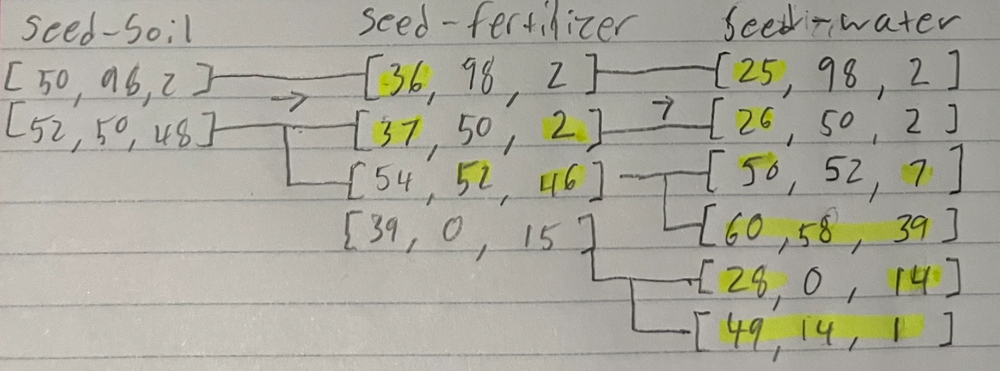

# Day 5 Notes

I am so happy I managed to get this done. I spent roughly 15 hours between creating an algorithm, implementing it, and debugging. Had it been on a day later than day 5 I likely would have given up but I didn't want to quit so early. I'm sure there were implementations that were easier to program but this one seemed most intuitive to me and used the least amount of confusing code. If any other problem surpasses this one in difficulty I won't be able to solve it.

# Part One
###### Personal difficulty rating = 2

### Solution logic
It took me forever to even understood how this problem worked. The logic shouldn't be too difficult to implement, but I am worried about writing a brute force solution with numbers this big. I remember doing some problem where comparing huge numbers was necessary. Before I write some code that checks within bounds more efficiently, I am going to write out the naive approach and just implement faster code afterwards if it does not work.

### Exceptions to logic
Last line of data must have a new line char at the end of it for this implementation to work

# Part Two
###### Personal difficulty rating = 10

### Solution logic
Upon reviewing how long operations take in python, comparing integers is not the reason the solution here is slow. This means that there must be some method to not run every single integer in the range we are given.  
  
### New Method (FAILED):  
Reverse engineer the process, starting at humidity to location and going up to see what starting number is the closest to ending up there. Since we have 2 billion seed numbers, one is bound to be close to the lowest possible location.  
   
### Updated Method:  
After thinking about it, I figured that although reverse engineering the mappings may be possible but I wouldn't know how to deal with unmapped numbers. However, I came up with an idea to make one big map by going through the maps and combining all the intermediate mappings in order to make one seed-to-location map. Once I do that, I can essentially reverse engineer the process by checking the lowest location mapping in seed-to-location and go from there to find which one of our seeds maps the lowest.
  
### Photo of concept:  

###### While coding I realized my conversions by hand were incomplete/incorrect, but it still conveys the general idea
